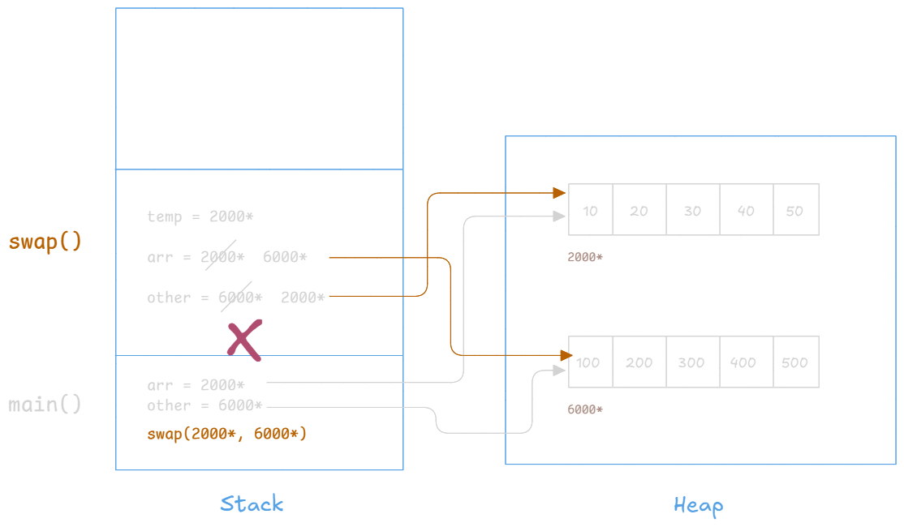

# L12 - Array Basic Questions

We're given 2 arrays `arr` and `other`, both of type `int[]`. And our motive is to implement a `swap` method such that it swaps their references i.e. `arr` should point the second array and `other` should point to the first array. Thereby swapping the two arrays.

```java
int[] arr = {10, 20, 30, 40, 50};
int[] other = {100, 200, 300, 400, 500};
```

So after swaping, `arr[0]` should print `100` and `other[0]` should print `10`. The code for the same is given below.

```java
package code.L12__Array_Basic_Questions;

public class C01_Swap_Reference {
    public static void main(String[] args) {
        int[] arr = { 10, 20, 30, 40, 50 };
        int[] other = { 100, 200, 300, 400, 500 };

        // print values
        System.out.println(arr[0] + " " + other[0]);

        swap(arr, other);

        // print values
        System.out.println(arr[0] + " " + other[0]);
    }

    public static void swap(int[] arr, int[] other) {
        int[] temp = arr;
        arr = other;
        other = temp;
    }
}
```

**Expected Output:**

```
10 100
100 10
```

But when you run the code, you get the following output.

**Actual Output:**

```
10 100
10 100
```

**Explaination:**

In this example, we just went near the door and hit the bell, no changes were made inside the house i.e. the arrays. Cause what we actually wanted to do is swap the two arrays so we decided to swap their refrences, but that didn't happen. Reason being the references that were passed to the `swap` method stores it in its local variables. The references were swapped though, but among the local variables only. Once the `swap` method finishes execution, its stack frame is destroyed - all its local variables get destroyed and there is no change in the original variables in the `main` method. The `arr` and `other` are still pointing to their original arrays.

<div class="page-break"></div>



Therefore, from the previous example in `L11` and this example, we can conclude that:

> **Jab tak ghar ke andar ghus ke change nhi karenge tab tak changes dusre method ko reflect nhi honge.**

---

Java is strictly **Call By Value**.

refrence ke basis pe agr mein cheezon ko change kr paun, aur agr chnages reflect ho gya, tb usae call by refrence kahenge